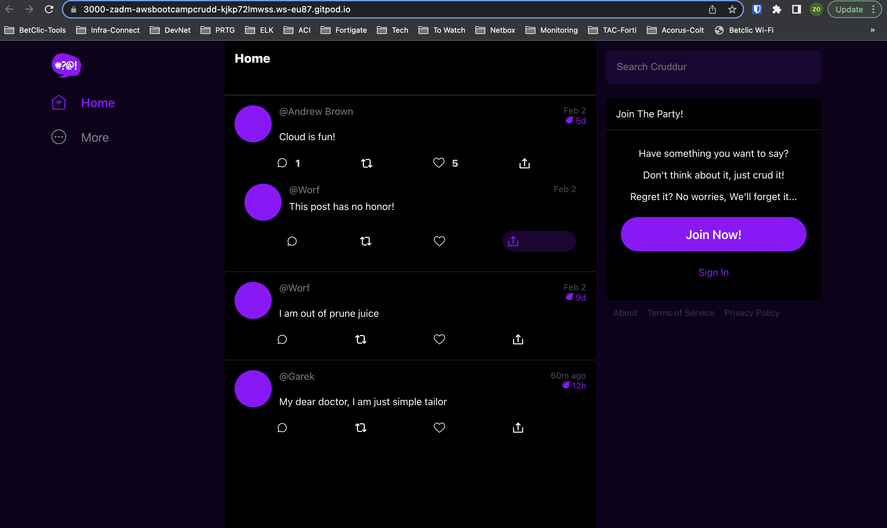
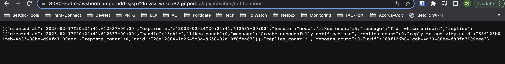
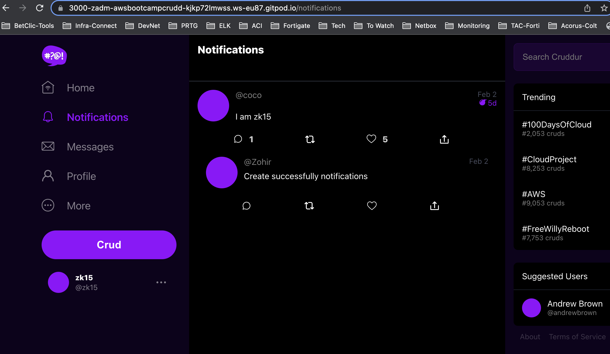
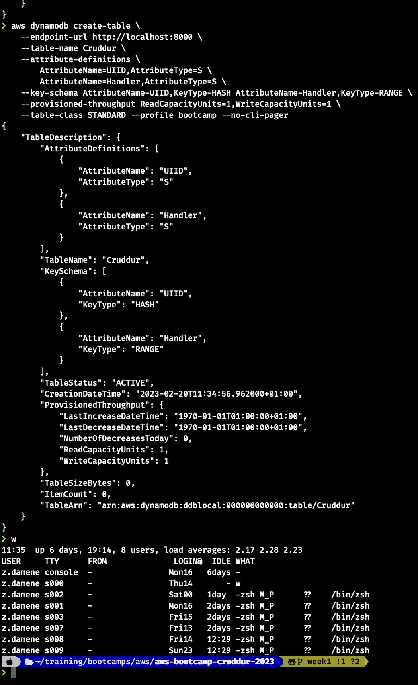
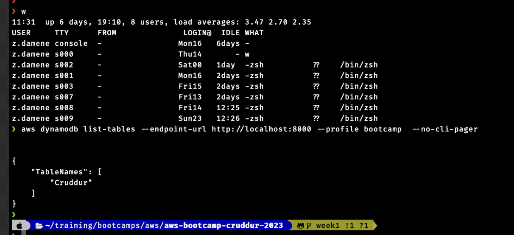
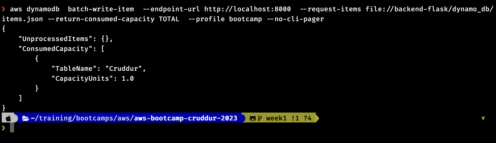
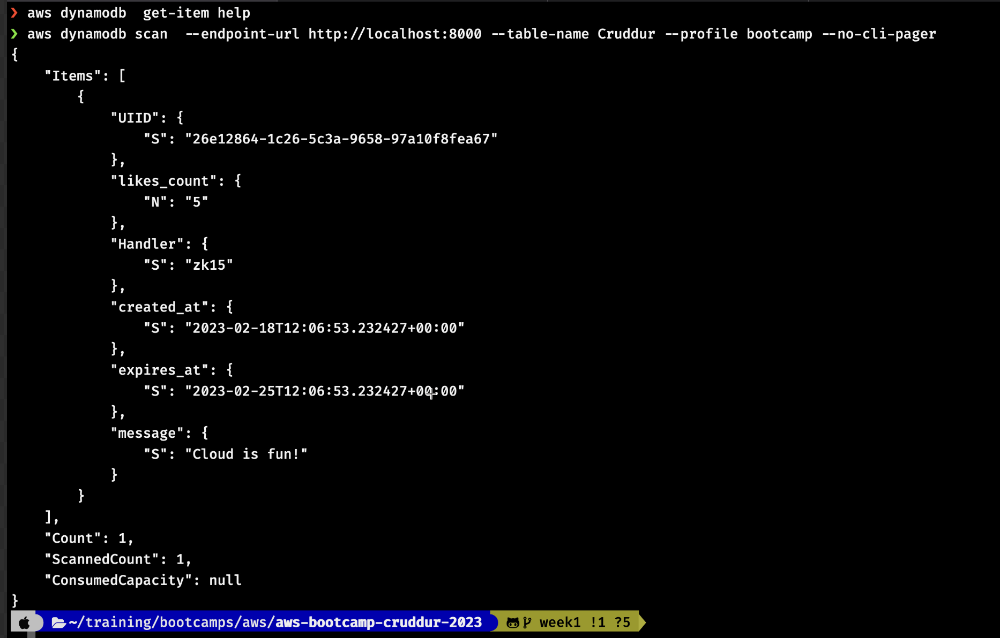
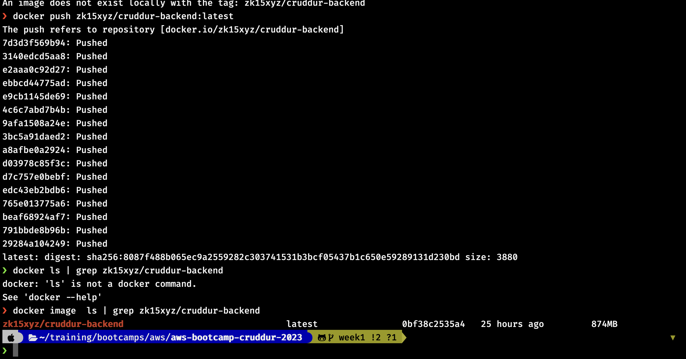
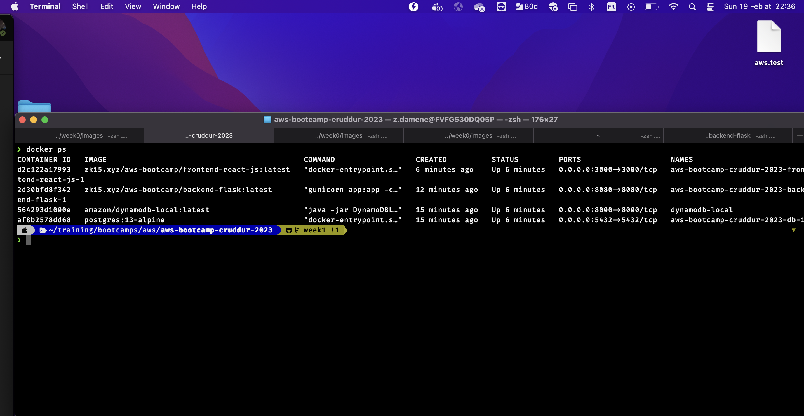

# Week 1 — App Containerization

# Required Homework

## Containerize Application (Dockerfiles, Docker Compose)

[Link to the backend docker file](../backend-flask/Dockerfile)

The application is running behind a gunicorn server [config file](../backend-flask/config/gunicorn.conf.py)

### Write the frontend docker file

[Link to the backend docker file](../frontend-react-js/Dockerfile)

### Write the docker compose file
[docker-compose](../docker-compose.yml)
### Run the application in gitpod

1. Launch the application in gitpod
2. Execute the docker-compose
   
```bash
docker-compose -f docker-compose.yml  up --build
```
3. Make the ports public
4. Open the cruddur URL in your browser


## Document the Notification Endpoint for the OpenAI Document

[Notification OpenAPI](../backend-flask/openapi-3.0.yml#L151-165)


## Write a Flask Backend Endpoint for Notifications




## Write a React Page for Notifications
Notification feature added to the application 



## Run DynamoDB Local Container and ensure it works

### Create a table



### List Tables



### Create an Item

[Item file](../backend-flask/dynamo_db/items.json)

```bash
aws dynamodb  batch-write-item  --endpoint-url http://localhost:8000  --request-items file://backend-flask/dynamo_db/items.json --return-consumed-capacity TOTAL  --profile bootcamp --no-cli-pager
```



### List items



# Homework Challenges

## Run the dockerfile CMD as an external script 

[Backend Docker file](../backend-flask/Dockerfile#L6)

[Frontend Docker file](../backend-flask/Dockerfile#L31)

The script is here [backend entrypoint](../backend-flask/entrypoint.sh) Or [frontend entrypoint](../frontend-react-js/entrypoint.sh)

The script take 1 argument (service name [FLASK, NODE]) and depend on the argument, the right application is launched.

Each application has their proper entrypoint for the feature cutom configuration.   


## Push and tag a image to DockerHub (they have a free tier)

The image is available to the public

Local push proof 



Docker hub 


Pull the image 

```bash
docker pull zk15xyz/cruddur-backend:latest
docker pull zk15xyz/cruddur-frontend:latest

```


## Use multi-stage building for a Dockerfile build Implement a healthcheck in the V3 Docker compose file


## Research best practices of Dockerfiles and attempt to implement it in your Dockerfile


## Launch an EC2 instance that has docker installed, and pull a container to demonstrate you can run your own docker processes. 


## Learn how to install Docker on your localmachine and get the same containers running outside of Gitpod / Codespaces

1. Docker locally 

<!--  -->

<!-- [Video docker local](https://user-images.githubusercontent.com/18516249/220197658-90488e0a-653e-48ec-964b-69215a9568a5.mov) -->

[]([../_docs/assets/week1/docker-local.mp4](https://user-images.githubusercontent.com/18516249/220201375-0b20206e-be26-479b-af17-704fd9a63a14.mp4))


https://user-images.githubusercontent.com/18516249/220201375-0b20206e-be26-479b-af17-704fd9a63a14.mp4


1. Cruddur locally


