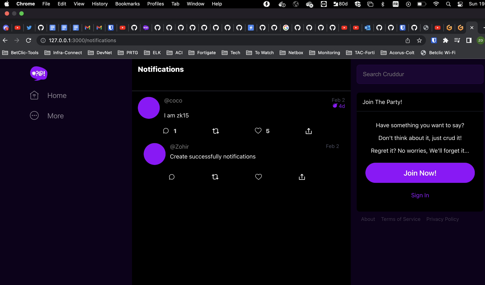

# Week 1 — App Containerization

# Required Homework

## Containerize Application (Dockerfiles, Docker Compose)

[Link to the backend docker file](../backend-flask/Dockerfile)

The application is running behind a gunicorn server [config file](../backend-flask/config/gunicorn.conf.py)

### Write the frontend docker file

[Link to the backend docker file](../frontend-react-js/Dockerfile)

### Write the docker compose file
[docker-compose](../docker-compose.yml)
### Run the application in gitpod

1. Launch the application in gitpod
2. Execute the docker-compose
   
```bash
docker-compose -f docker-compose.yml  up --build
```
3. Make the ports public
4. Open the cruddur URL in your browser


## Document the Notification Endpoint for the OpenAI Document

[Notification OpenAPI](../backend-flask/openapi-3.0.yml#L151-165)


## Write a Flask Backend Endpoint for Notifications


## Write a React Page for Notifications
Notification feature added to the application 


## Run DynamoDB Local Container and ensure it works

### Create a table


### List Tables


### Create an Item

```bash
aws dynamodb  batch-write-item  --endpoint-url http://localhost:8000  --request-items file://backend-flask/dynamo_db/items.json --return-consumed-capacity TOTAL  --profile bootcamp --no-cli-pager
```


### List items


# Homework Challenges

## Learn how to install Docker on your localmachine and get the same containers running outside of Gitpod / Codespaces

1. Docker locally 


2. Cruddur locally

