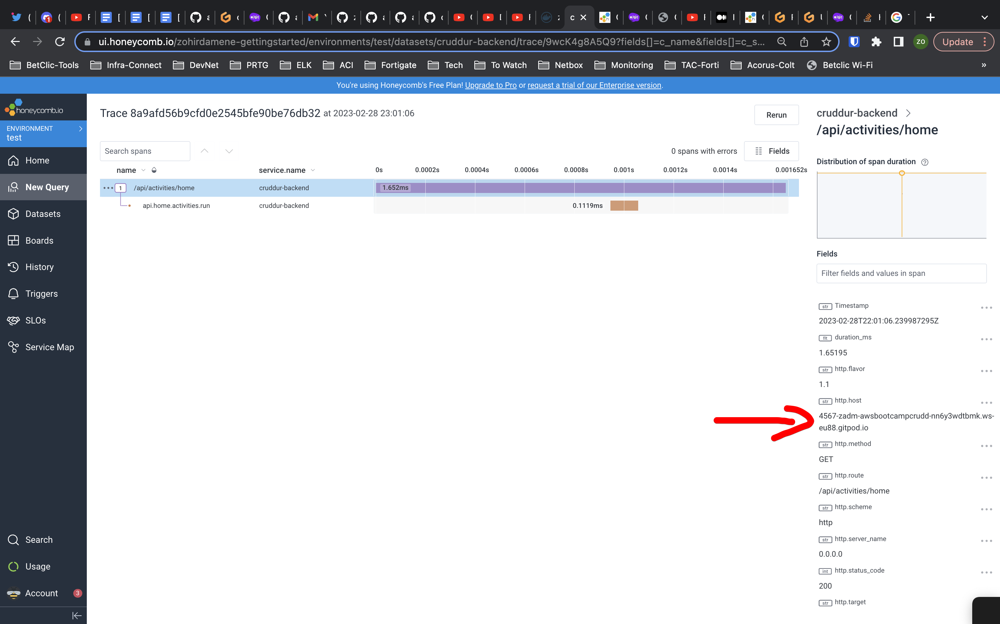
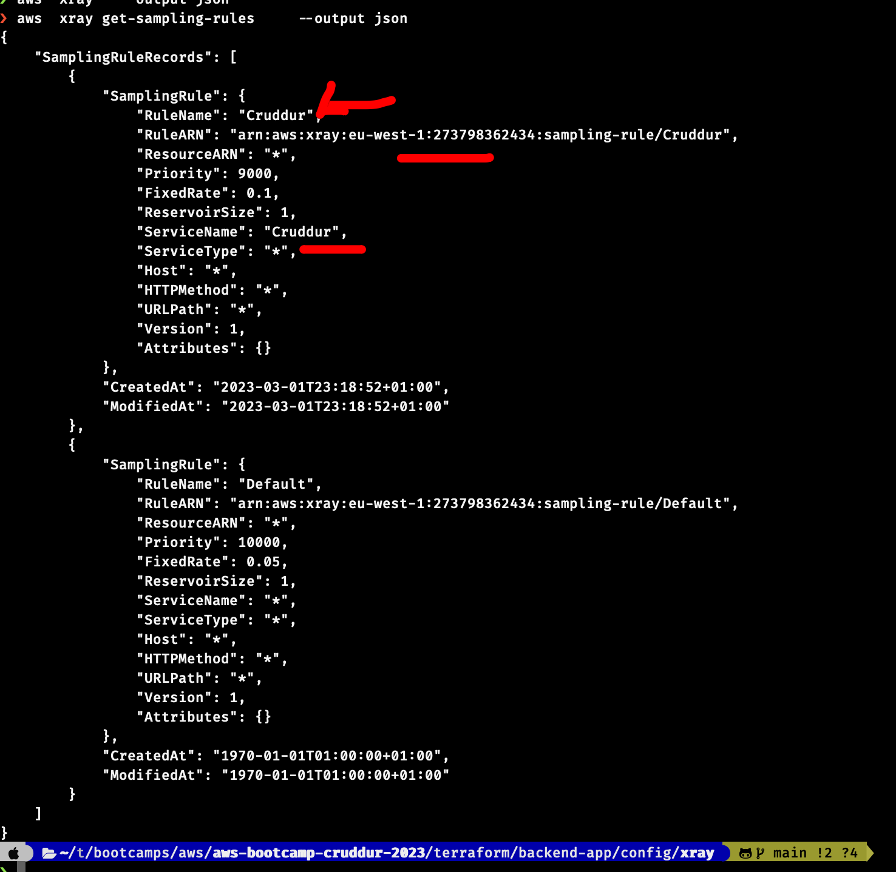

# Week 2 — Distributed Tracing

# Instrument our backend flask application to use Open Telemetry (OTEL) with Honeycomb.io as the provider

## Add opentelemetry to instrument flask app 
### Instrument flask application
[honeycomb module](../backend-flask/services/tracing/honycomb.py)

### Add span to home activities

   


### Add span to notification activieties


# Run queries to explore traces within Honeycomb.io

## Notification activities tarce


## Show routes in honeycomb


## Query where result exist


## Query p99


## Query where app.received.date exists


## Honeycomb trace from gitpod



# Instrument AWS X-Ray into backend flask application

## Setup AWS X-Ray Resources
All the aws resources have been created using terraform

[xray terraform stack](../terraform/backend-app/stacks/xray/)

[xray terraform config](../terraform/backend-app/config/xray/)


1. Create xray group


2. Create a simple rule





## Add a new python module to handle xray
[xray python module](../backend-flask/services/tracing/aws_xray.py)

This module contains the code to instrument a falsk application. 

## Configure and provision X-Ray daemon within docker-compose and send data back to X-Ray API
[xray docker-compose](../docker-compose.yml#L73-82)

Console output of xray daemon


## Observe X-Ray traces within the AWS Console

### tarce list and graph


### all request with http.code == 200


### home activities subsegment

I added a subsegment for the HomeActivities class 

[xray subsegment](../backend-flask/services/home_activities.py)

I managed to instrument this method with both xray and honneycomb, like that the traces are send to both of them


# Install WatchTower and write a custom logger to send application log data to CloudWatch Log group

### Python module to setup logging

[logging](../backend-flask/services/logging/logger.py)

In python you can get a logger at any point by instanciating the Logger class from logging module by passing the name of the logger 

The [logging](../backend-flask/services/logging/logger.py) method settup cruddur logger for the application. The cloud watch is enabled by setting the env variable ENABLE_CLOUD_WATCH_LOG

```bash 
export ENABLE_CLOUD_WATCH_LOG="False"
```

The function will load the variable if defined and enable the cloudwatch. If this variable is absent, only console log is enbaled

The function `setup_logger` is called one time at the init of the application

in app.py
```python 
from services.logging.logger import setup_logger
setup_logger()
```
Now, at any point in your application, you can get cruddur logger with the bellow code 

```python
import logging
logger = logging.getLogger("cruddur")
logger.info("INFO")
```
### proof

aws cloud watch group


aws docker-compose flask service logs


# Trigger an error an observe an error with Rollbar

The module managing rollbar logging is [here](../backend-flask/services/logging/rollbar.py)
sending log to rollbar is controlled by the env variable `ENABLE_ROLLBAR_LOG`

### Gitpod
1. Add `ROLLBAR_ACCESS_TOKEN: <TOCKEN>` in you gitpod env variables
2. Add `ENABLE_ROLLBAR_LOG: True` in you gitpod env variables or in  [bootsrap_gitpod](../bash/bootstrap_gitpod.sh#L24-34)
3. Launch the repo in gitpod
4. try access to `BACKEND_URL/rollbar`

### Proof of work
https://user-images.githubusercontent.com/116020237/222786459-401c5f36-3412-41f5-a72b-e0176e9585ee.mp4


