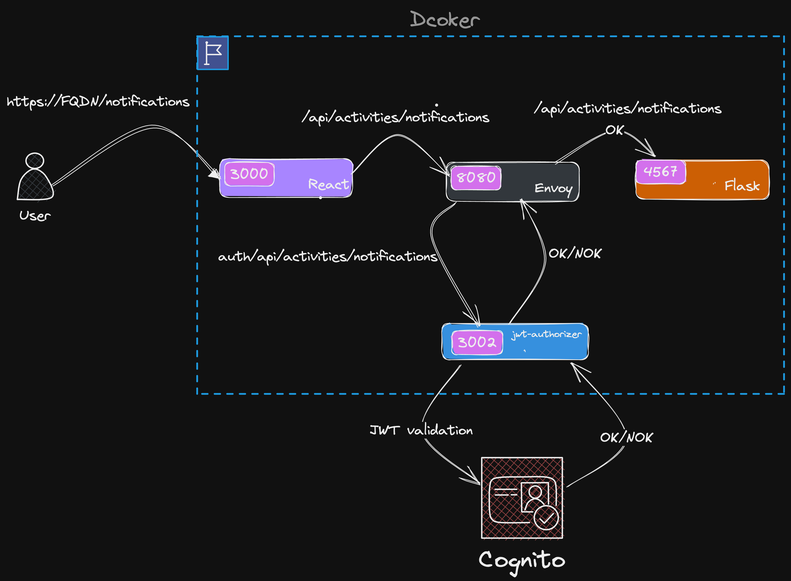

# Week 3 — Decentralized Authentication

# Setup Cognito User Pool

## Using terraform 

[terraform module](../terraform/stacks/cognito/)

https://user-images.githubusercontent.com/18516249/224418097-cac9eb34-7ae6-4b4a-9c5b-80707e31d77c.mp4

# Implement Custom Signin/Signup/Custom/Confirmation Page

## POC

# Implement Custom Recovery Page	

# Homework Challenges 

# Decouple the JWT verify from the application code by writing a  Flask Middleware

[python JWT cognito Middleware folder](../backend-flask/services/middleware/flask_cognito.py)

# [Hard] Decouple the JWT verify by implementing a Container Sidecar pattern using AWS’s official Aws-jwt-verify.js library

## Architecture 

## Node application with aws-jwt-verify official library
### `jwt-authorizer`

The application is packaged in a docker container and bind to port 3002
All the requests sent to `"/auth/*"` endpoint will be processed and run a JWT validation process with cognito.

[Application folder](../jwt-authorizer-api/)

[Docker File](../jwt-authorizer-api/Dockerfile)

### `Envoy front proxy`
Envoy front proxy is setup in front of the jwt-authorizer in order to proxy the http request send from the react app. All the request with the path /api/ are intercepted and validated the token with jwt-authorizer. 

[Envoy config file](../envoy/front-envoy.yaml)

[Envoy Dockerfile](../envoy/Dockerfile)

## `POC `

